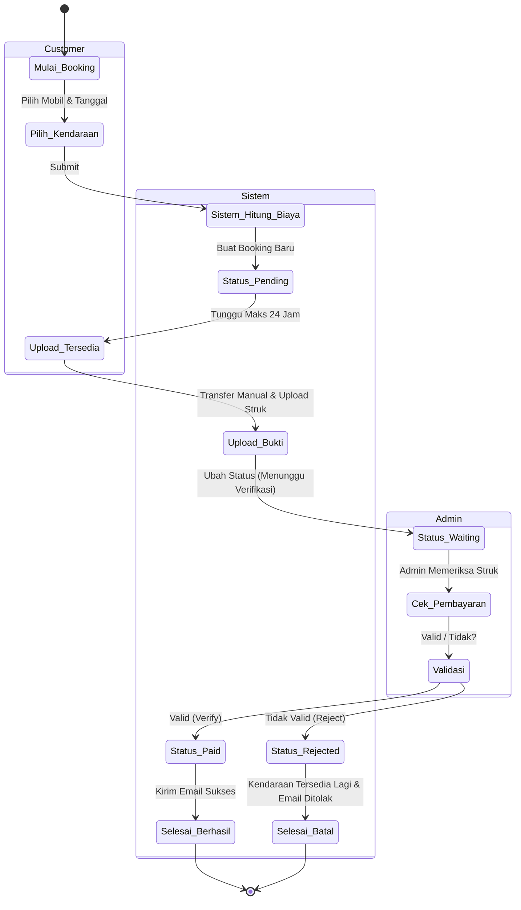

# Activity Diagram: Booking & Pembayaran

```mermaid
stateDiagram-v2
    [*] --> Mulai_Booking
    
    state Customer {
        Mulai_Booking --> Pilih_Kendaraan: Pilih Mobil & Tanggal
        Pilih_Kendaraan --> Sistem_Hitung_Biaya: Submit
    }
    
    state Sistem {
        Sistem_Hitung_Biaya --> Status_Pending: Buat Booking Baru
        Status_Pending --> Upload_Tersedia: Tunggu Maks 24 Jam
    }
    
    state Customer {
        Upload_Tersedia --> Upload_Bukti: Transfer Manual & Upload Struk
    }
    
    state Sistem {
        Upload_Bukti --> Status_Waiting: Ubah Status (Menunggu Verifikasi)
    }
    
    state Admin {
        Status_Waiting --> Cek_Pembayaran: Admin Memeriksa Struk
        Cek_Pembayaran --> Validasi: Valid / Tidak?
        Validasi --> Status_Paid: Valid (Verify)
        Validasi --> Status_Rejected: Tidak Valid (Reject)
    }
    
    state Sistem {
        Status_Paid --> Selesai_Berhasil: Kirim Email Sukses
        Status_Rejected --> Selesai_Batal: Kendaraan Tersedia Lagi & Email Ditolak
    }
    
    Selesai_Berhasil --> [*]
    Selesai_Batal --> [*]
```
