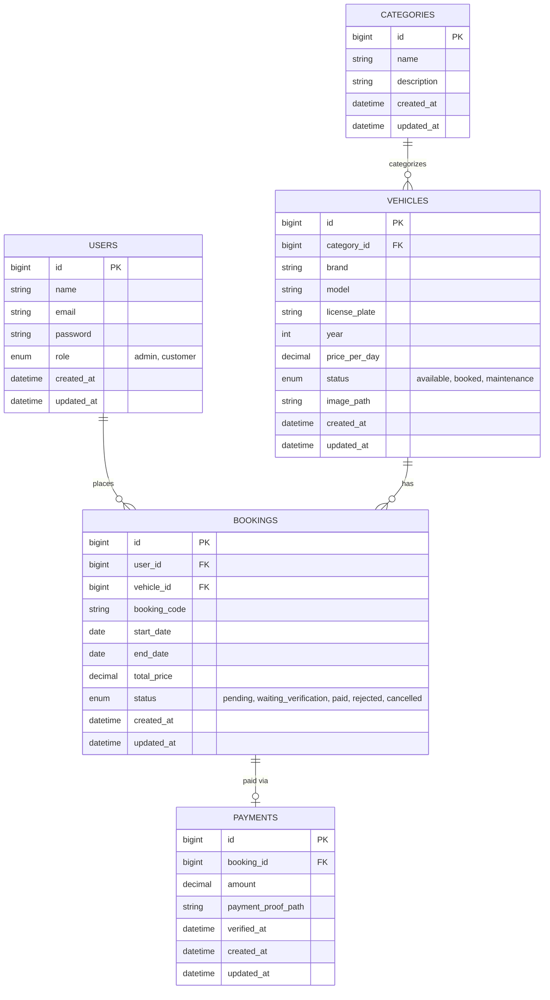

# Entity Relationship Diagram (ERD)

```mermaid
erDiagram
    USERS {
        bigint id PK
        string name
        string email
        string password
        enum role "admin, customer"
        datetime created_at
        datetime updated_at
    }

    CATEGORIES {
        bigint id PK
        string name
        string description
        datetime created_at
        datetime updated_at
    }

    VEHICLES {
        bigint id PK
        bigint category_id FK
        string brand
        string model
        string license_plate
        int year
        decimal price_per_day
        enum status "available, booked, maintenance"
        string image_path
        datetime created_at
        datetime updated_at
    }

    BOOKINGS {
        bigint id PK
        bigint user_id FK
        bigint vehicle_id FK
        string booking_code
        date start_date
        date end_date
        decimal total_price
        enum status "pending, waiting_verification, paid, rejected, cancelled"
        datetime created_at
        datetime updated_at
    }

    PAYMENTS {
        bigint id PK
        bigint booking_id FK
        decimal amount
        string payment_proof_path
        datetime verified_at
        datetime created_at
        datetime updated_at
    }

    USERS ||--o{ BOOKINGS : "places"
    CATEGORIES ||--o{ VEHICLES : "categorizes"
    VEHICLES ||--o{ BOOKINGS : "has"
    BOOKINGS ||--o| PAYMENTS : "paid via"
```
